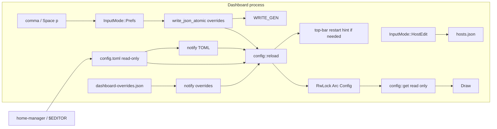

# In-dashboard preference panel

**Status:** Draft (revised after r3 review)
**Date:** 2026-08-22
**Author:** captain-miao design

A keyboard-first ratatui overlay for the handful of tunables you actually
change while using the dashboard. It writes
`~/.local/state/captain-miao/dashboard-overrides.json`. It never writes
`config.toml`. Default agent and default host are not prefs rows: they
are the first entry of an ordered list (agents in this overlay, hosts in
`Space h`).

---

## Overview

`~/.config/captain-miao/config.toml` is the **declarative** file:
hand-edited, Home Manager-generated, or a dotfiles symlink. Runtime
choices already persist into
`~/.local/state/captain-miao/dashboard-overrides.json` and **win** over
TOML. The TUI has no way to see or change most of that without leaving
the dashboard, and the four Normal-mode shortcuts that do persist
(`Space a` / `H` / `l` / `z`) are easy to miss.

This document proposes:

1. A **Preferences overlay** (`InputMode::Prefs`), opened with
   `Command::Preferences` (default `,` and `Space p`). Same family as
   Hosts / Messages / Help: `clear_overlay`, overlay-owned keys until
   Esc, persist-on-commit into `dashboard-overrides.json` via
   `write_json_atomic`. `config.toml` is read-only from the dashboard.
2. **Hosts panel** (`Space h`) grows a localhost placeholder, reorder,
   and a pooled-localhost toggle on that row. The first host in the
   list is the default; `Ctrl-h` in pickers cycles that order.
3. An **Agents** category in prefs: reorder, disable, first enabled is
   the default; `Ctrl-t` in pickers cycles that order.

The four shortcuts `Space a` / `Space H` / `Space l` / `Space z` are
**unbound in `DEFAULTS`**. The `Command`s stay remappable. Layout and
keep-awake live in the overlay; agent/host defaults live in the ordered
lists.

Live presentation knobs take effect immediately via a reloadable
in-memory `Config` (`RwLock<Arc<Config>>`) that **merges** compiled
defaults ← TOML ← overrides. `config::get()` only reads that slot.
`config::reload()` is the only function that hits disk. Pooled-localhost
applies to **new** sessions without a dashboard restart. Kitty password
is still restart-labelled.

---

## Background & Motivation

### What exists today

Configuration is an optional TOML file at
`~/.config/captain-miao/config.toml`. Every key is optional; a missing
or unparseable file falls back to defaults (`src/config.rs`
`Config::load`, `crates/cm-core/src/config.rs` `CoreConfig::load`).

Two independent loaders parse the **same file**, both `OnceLock`:

| Loader | Crate | Used by |
| --- | --- | --- |
| `crate::config::get()` | `captain-miao` | dashboard TUI |
| `cm_core::config::get()` | `cm-core` | launcher process, daemon, `debug_enabled()` |

Neither writes the file. That is a feature for NixOS / Home Manager.

`~/.local/state/captain-miao/dashboard-overrides.json`
(`App::save_overrides` / `load_overrides`) currently mixes:

- Prefs: `default_agent`, `default_host`, `sessions_layout`, `prevent_sleep`
- Session state: local `pinned` / `follow_up` pid lists

Pooled hosts already keep pins/follow-up in the host-owned
`session-flags.json` sidecar (`cm_core::state::session_flags_path`,
AGENTS.md). Local flags should not live in the prefs file.

Normal-mode defaults today (`src/app/keymap.rs` `DEFAULTS`):

| Command | Default keys | Becomes |
| --- | --- | --- |
| `DefaultAgent` | `Space a` | unbound; Agents category |
| `DefaultHost` | `Space H` | unbound; first host in `Space h` |
| `SessionsLayout` | `Space l` | unbound; prefs row |
| `ToggleKeepAwake` | `Space z` | unbound; prefs row |
| `ManageHosts` | `Space h` | stays |

`Ctrl-t` (cwd picker) already cycles `AgentControl::ALL` in compile
order, skipping unavailable binaries. `Ctrl-h` already cycles
configured hosts in `hosts.json` order, with localhost implicit and
unlisted.

### Pain

1. The important knobs are undocumented in the TUI.
2. `config::get()` is a `OnceLock`; a TOML or overrides edit needs a
   restart.
3. Writing `config.toml` from the TUI would fight Home Manager.
4. Hardcoded presentation: bar RGB `#313244`, status colors, context
   70%/90% of window (should be absolute tokens only), always-on
   auto-reattach, always-on follow-up auto-arm.
5. Default agent/host are one-shot picks, not an ordered list you can
   disable or cycle predictably.

### Constraints

Unidirectional dashboard, `run_command` as the only Normal-mode side
effect, `keys_for` / `primary_key`, branch on capability not locality,
state files owner-only via `write_json_atomic`. No new IPC. No
`$HOME` on the wire.

---

## Goals & Non-Goals

### Goals

- Overlay for knobs you change while looking at sessions.
- **Never write `config.toml`.**
- **Overrides win.** Effective = compiled default ← TOML ← overrides.
  `r` deletes that override.
- Ordered **agent list** (prefs) and **host list** (hosts panel): first
  enabled/first in list is the default; pickers cycle that order.
- Local pins/follow-up **leave** `dashboard-overrides.json`.
- Live apply for presentation and for pooled-localhost (new
  sessions only). Restart-labelled for kitty password.
- Pref rows that depend on a capability **stay visible** and show why
  they currently have no effect (except kitty password, Kitty-only).
- Watch **both** `config.toml` and `dashboard-overrides.json`. A
  restart-gated change from either source paints a hint on the right
  of the top bar.
- `get()` reads memory; `reload()` is the only disk function.

### Non-Goals

- A keymap editor. Remaps stay `[keybinds]` in `config.toml`. `?` is
  the view. The four default-agent/host/layout/keep-awake *commands*
  remain remappable; they are just not in `DEFAULTS`.
- Editing every TOML key (titles, polling floors, picker caps, panel
  geometry, debug filenames).
- A `[terminal] backend` pin. Auto-detect stays the only mechanism.
- A mouse on/off pref. Capture stays always on, as today.
- Prefs for auto-reattach or auto-mark-idle. Both stay always on.
- Percentage-based context coloring.
- `CAPTAIN_MIAO_RC_PASSWORD` as a user-facing or child env var.
- Hosts.json / directory marks / session flags as prefs.
- Writing anything into `config.toml`.
- IPC, protocol bump, theme marketplaces, hot-swapping the terminal
  backend.

---

## Key Decisions

1. **The panel writes `dashboard-overrides.json`, never `config.toml`.**
   Home Manager owns the declarative file.

2. **One merge, three layers.** Compiled ← TOML ← overrides.
   `config::get()` returns the merged `Config` already in memory.

3. **`get()` does not I/O.** `config::get() -> Arc<Config>` clones the
   `RwLock` slot. `config::reload()` (and `reload_from` in tests)
   re-reads TOML, re-reads overrides, merges, replaces the slot.
   Watchers and pref writes call `reload()`, never `get()`. Bind
   `let cfg = config::get();` before borrowing fields because the
   `Arc` is not `&'static`.

4. **Curated catalog.** Agents (order/disable), keep-awake, layout,
   window-close, context token thresholds, preview refresh, a short
   color set, kitty password. Not keybinds, not backend pin, not
   mouse, not percentages, not auto-reattach, not auto-mark-idle
   (those two stay always-on core behaviour).

5. **Default agent = first enabled agent. Default host = first host
   in the hosts panel.** No separate "default" enum rows. `Ctrl-t` /
   `Ctrl-h` in pickers walk those lists.

6. **Unbind `Space a` / `H` / `l` / `z` from `DEFAULTS`.** Commands
   stay in the keymap so a user can bind them. `Space h` stays.

7. **Pins and follow-up leave this file.** Local flags migrate into
   `session-flags.json` (the path pooled hosts already use).
   `dashboard-overrides.json` is prefs only. `save_overrides`
   constructs prefs without `pinned` / `follow_up`. One-shot: copy
   those two arrays into `session-flags.json` under local pids, then
   drop them from overrides.

8. **Capability: warn, don't hide** — except kitty password, which
   stays Kitty-only (confirmed). A keep-awake / on-window-close row
   that cannot take effect right now is still editable and shows a
   one-line reason ("no systemd-inhibit on this machine", "no pooled
   sessions right now"). Turning pooled on can make the latter live
   without a dashboard restart.

9. **Kitty password is not a secret.** The row does not show the
   value. Enter opens a plaintext `TextInput`. Internally `kitten @`
   uses `--password-file` under `$XDG_RUNTIME_DIR/captain-miao/`
   (0600), not `CAPTAIN_MIAO_RC_PASSWORD`.

10. **No `[terminal] backend` override.** `detect_backend` is enough.
    Drop the panel row. Leave the TOML key in the parser with
    `#[serde(default)]` so an existing file still loads, but the
    dashboard ignores it (or keep honouring TOML for one release —
    **ignore it**. Auto-detect only).

11. **Watch TOML and overrides.** Echo of our own overrides write is
    skipped with `WRITE_GEN`. TOML we never write, so no echo there.
    If the newly merged config differs in a Restart-tagged field
    (kitty password), the top bar's right side shows `restart to
    apply`. Pooled is **not** restart-tagged.

12. **Context coloring is absolute tokens only.** When a window size
    is known, do **not** switch to 70/90% of that window. Always
    `context_warning_tokens` / `context_critical_tokens`. Remove the
    hardcoded percentage branch in `context_pressure_style`.

13. **Overlay, not full-screen; own `InputMode`.** Nested confirms
    stay inside prefs state.

14. **No IPC.**

15. **Pooled-localhost is live, new sessions only.** Do not swap
    `backends[0]` at construction (`this_machine_backend` today is
    Local XOR Remote). Keep in-process listing. `daemon ensure` on
    demand when the first *new* pooled spawn needs it (or when the
    toggle turns on, so the next `o` is ready). Existing sessions
    keep their nature: an unpooled window-launcher stays that;
    a pooled session stays in the pool until the user kills it.
    `daemon stop` only when the toggle is off **and** this machine
    has zero pooled sessions (stop would otherwise kill the pool).
    New spawns after the toggle follow the new setting.

16. **Localhost in the hosts panel is synthesized, never loaded.**
    Today's `hosts.json` lists remotes only; local is implicit. The
    row cannot be "missing" from the panel — the UI always draws it.
    Remotes stay in `hosts.json`. Order of `[local + remotes]` is a
    parallel `host_order: Vec<String>` (in overrides) that names
    `"local"` and each remote label. If `host_order` is absent,
    local is first, then `hosts.json` order — that is today's
    default, not an inject-into-the-file step.

---

## Preference Inventory

Legend: **Live** = next frame; **Restart** = next dashboard start;
**yes** = overlay writes an override; **hosts** = hosts panel;
**no** = not a pref.

An **override** tag means overrides currently win. `r` clears it.

### In the preferences overlay

#### Agents

Not a bool/enum row. A list editor over `AgentControl::ALL`:

| Gesture | Effect |
| --- | --- |
| `j` / `k` | move cursor |
| `J` / `K` (or `d`/`u` shift) | move the row in the list (persist order) |
| `x` or `d` | disable / enable. Disabled agents are omitted from pickers and `Ctrl-t` even if the binary is on `$PATH` |
| `r` | reset order + enabled to compiled `ALL` (all enabled, compile order) |

The **first enabled** agent is the default for `o` / `O` / `r` when no
row is selected. `Ctrl-t` in the cwd picker cycles **enabled** agents
in this order (today it walks `ALL`, skipping `!is_available()`).
Deliberate launch of a disabled agent is still possible if someone
binds `DefaultAgent` and we keep that picker — **do not**: a disabled
agent is hidden. `--agent` on the CLI is unchanged (not the TUI).

Unknown names in the override list are skipped. Agents in `ALL` that
are missing from the override are **appended, enabled**, so a new
captain-miao agent appears instead of vanishing. Persist the resolved
list on next write so the file catches up.

Stored as `prefs.agents: [{ "id": "claude", "enabled": true }, …]`.

#### General

| Id | Label | Type / default | Source today | Apply | Panel |
| --- | --- | --- | --- | --- | --- |
| `terminal.sessions_layout` | Session layout | `stacked\|per-tab` / stacked | config.toml; overrides after `Space l` | Live for new spawns | **yes**. Warning, not hidden, when `!layout_is_a_choice()` ("tmux/Ghostty/iTerm2 only have per-tab — takes effect if you switch to kitty/zellij"). |
| `ui.keep_awake` | Keep-awake | omitted = `sleep::supported()` | overrides `prevent_sleep` | Live | **yes**. Always listed. When unsupported, a warning line: "no sleep inhibitor on this machine"; the toggle still persists so a later machine/binary honours it. |
| `remote.on_window_close` | On window close | `close\|detach` / `close` | config.toml | Live | **yes**. Warning when there are no pooled sessions right now: "no pooled sessions right now". Only wrapper status 129 honours it (AGENTS.md). |

**Always on, not in the panel:**

- **Mark idle as needing input** (`follow_up_transitions`). Core
  behaviour; `i` still toggles one row. No pref, no TOML key.
- **Reattach on reconnect** (`sweep_reconnected_hosts`). When a
  remote (or local-pool) `reconnect_epoch` advances and it is not
  the host's first sighting, re-attach every session this dashboard
  still expects to hold, that has no window, and that the host
  reports running. `D`etach clears the expectation. Held-elsewhere
  is skipped. No pref, no TOML key.

#### Display

| Id | Label | Type / default | Apply | Panel |
| --- | --- | --- | --- | --- |
| `thresholds.context_warning_tokens` | Context warning | u64 / `175000` | Live | yes. If warn ≥ crit, bump crit. |
| `thresholds.context_critical_tokens` | Context critical | u64 / `400000` | Live | yes |
| `polling.preview_auto_refresh_secs` | Preview auto-refresh | u64 / `10` (`0` off) | Live | yes. Warning if `!capabilities.capture` ("this terminal cannot capture preview"). |
| `thresholds.preview_stale_secs` | Preview stale after | u64 / `20` (`0` = always fresh) | Live | yes. Same capture warning. |

No `context_*_pct` keys. `context_pressure_style` uses only these
token cuts, whether or not `context_window` is known.

Clamps: tokens 1_000..=2_000_000 step 5_000; refresh 0..=120 step 1;
stale 0..=600 step 5.

#### Colors

Short set you notice on the table, plus reset (clears color
**overrides** only, never TOML).

| Id | Default |
| --- | --- |
| `colors.ui.highlight_bg` | `dark_gray` |
| `colors.ui.selection_fg` | `blue` |
| `colors.ui.attention_fg` | `yellow` |
| `colors.ui.error_fg` | `red` |
| `colors.bar.bg` | `#313244` (`Rgb(49, 50, 68)`) **new** |
| `colors.bar.key_bg` | `#45475a` **new** |
| `colors.bar.fg` | `#cdd6f4` **new** |
| `colors.bar.label_fg` | `#bac2de` **new** |
| `colors.status.attention` | `yellow` **new** |
| `colors.status.busy` | `green` **new** |
| `colors.status.failed` | `red` **new** |

No extra palettes. Skip `Color::Reset` in Tab-cycle. Model-family
and `DIR_COLORS` stay code.

#### Terminal

| Id | Label | Apply | Panel |
| --- | --- | --- | --- |
| `kitty.rc_password` | Kitty remote-control password | **Restart** | **yes**, Kitty-only (hidden otherwise — confirmed). Value column is a dim `(set)` / `(default)` — **not** the password. Enter opens a plaintext field. Empty Enter keeps the current value. `r` clears the override. |

`kitten @` is invoked with `--password-file` pointing at
`$XDG_RUNTIME_DIR/captain-miao/kitty-rc-password` (0600, written from
the effective password at startup and on apply). Do **not** set
`CAPTAIN_MIAO_RC_PASSWORD`. Do not read it. `--password` on argv stays
forbidden (`ps`).

### In the hosts panel (`Space h`) — not prefs

Localhost is a **synthesized placeholder**, always drawn, not
deletable. It is not a `hosts.json` record and so cannot be
"missing" from the file — today's files list remotes only.

| Gesture / field | Effect |
| --- | --- |
| Localhost row | Label `local` (`HostId::local()`). No ssh target. Icon as today. |
| `pooled` on that row | Today's `[launcher] pooled`. **Live, new sessions only** (see below). |
| Reorder (`J`/`K`) | Writes `prefs.host_order` (names `"local"` and remote labels). **First is the default host** for `o` / `O` / `r`. |
| `Ctrl-h` in pickers | Cycles `host_order`, including localhost. |
| Existing `c` disable | Remotes only. Localhost cannot be disabled. |
| `d` delete | Remotes only. |

Default `host_order` when the key is absent: `["local", …hosts.json
labels in file order]` — today's implicit default. Unknown labels
are skipped; remotes not in the list are appended. Never rewrite
`hosts.json` just to insert a fake local entry.

`ui.default_host` / `DashboardOverrides.default_host` / `Space H`
go away. One-shot: if overrides has `default_host = "box"` and
`box` is a configured remote, put `"box"` first in `host_order`
then drop the typed field.

`launcher.pooled` TOML remains for HM; the localhost-row toggle
writes `prefs.pooled`. The row shows the effective value.

### Not in the panel

| Thing | Where | Why |
| --- | --- | --- |
| `[keybinds]` | config.toml | Versioned with the rest of the keymap. `?` is the view. |
| `Space a` / `H` / `l` / `z` default bindings | unbound | Commands remain remappable |
| `launcher.default_agent` as a single enum | Agents list | First enabled |
| `ui.default_host` | hosts panel order | First in list |
| `launcher.pooled` as a prefs row | localhost row | Same toggle, better home |
| `terminal.backend` | removed | Auto-detect only. TOML key ignored if present |
| `ui.mouse` | always on | No user-facing reason to turn off capture |
| Auto-reattach / auto-mark-idle | always on | Core behaviour, not prefs |
| `context_*_pct` | removed | Absolute tokens only |
| Title templates, picker caps, polling floors, panel geometry | config.toml | Set-once |
| `debug.*`, `CAPTAIN_MIAO_*` plumbing | file / env | Not settings |
| Pins / follow-up | `session-flags.json` | Not prefs |
| `LEARN_LONG_RUNNING_AFTER` | code | Out of v1 |

---

## Proposed Design

### Architecture



### `get()` vs `reload()`

```rust
pub fn get() -> Arc<Config> {
    slot().read().unwrap_or_else(PoisonError::into_inner).clone()
}

/// Re-read config.toml + dashboard-overrides.json, merge, replace the slot.
/// Watchers, pref writes, and tests call this. get() never does.
pub fn reload() -> Arc<Config> { reload_from(&config_path(), &overrides_path()) }
```

Call sites that borrowed `config::get().field` bind `let cfg =
config::get()` first. The run loop calls `get()` each iteration for
polling; it does not call `reload()` on a timer — notify does.

`cm_core::config::get()` stays a read of *that* process's TOML slot.
Launchers do not merge dashboard overrides.

### `DashboardOverrides`

Prefs only. No `pinned`, no `follow_up`.

```rust
struct DashboardOverrides {
    #[serde(default)]
    prevent_sleep: Option<bool>,
    #[serde(default)]
    sessions_layout: Option<String>,
    #[serde(default, skip_serializing_if = "PrefsOverrides::is_empty")]
    prefs: PrefsOverrides,
}

struct PrefsOverrides {
    on_window_close: Option<String>,
    pooled: Option<bool>,
    kitty_rc_password: Option<String>,
    agents: Option<Vec<AgentPref>>, // None = compiled ALL, all enabled
    host_order: Option<Vec<String>>, // "local" + remote labels; None = local first
    context_warning_tokens: Option<u64>,
    context_critical_tokens: Option<u64>,
    preview_auto_refresh_secs: Option<u64>,
    preview_stale_secs: Option<u64>,
    // colors.* Options …
}

struct AgentPref { id: String, enabled: bool }
```

`default_agent` and `default_host` are **deprecated** on the struct
(`#[serde(default)]` still parses them for migration, then
`save_overrides` omits them).

`save_overrides` reads current prefs from `App` / the slot, writes
the struct above, never a `Default` that drops `prefs`. Tests: pin a
session (now a `session-flags.json` write) while `prefs.pooled =
true`; overrides file still has the pref.

### Session flags migration

On `load_overrides`, if `pinned` or `follow_up` are non-empty:

1. For each pid, `set_session_flags` on the local backend (the same
   `session-flags.json` `LocalBackend` already knows).
2. Rewrite overrides **without** those keys.

If local is pooled-localhost, the server owns that file — then these
arrays should already have been empty for remotes; remaining local
pids still go through the local backend's writer only when we are
direct-local. When pooled, skip the write and drop the keys (the
server is the writer; stale dashboard copies of pids are not truth).

### Watchers

- `config.toml`: same notify pattern as detach reports (drop Access,
  parent fallback, symlink target + link parent). No `WRITE_GEN`.
- `dashboard-overrides.json`: same pattern. After *our* successful
  `write_json_atomic`, `bump_write_gen()`. The run loop skips echo
  when `write_gen() == last_applied_write_gen`.
- Debounce both with `polling.fs_reload_debounce_ms`.
- Parse error of TOML: keep live Arc, set `load_warning`. Parse error
  of overrides: keep live prefs, status warning. Neither write is
  attempted onto a broken TOML.

**Restart hint.** After a merge, if `kitty.rc_password` differs from
the value captured at process start, set `App.restart_needed`.
`draw` puts a dim/attention span on the **right** of the header bar,
e.g. `restart · kitty password`. Cleared only by process exit.
Pooled does not set this hint.

### Pooled-localhost, live, new sessions only

Today `this_machine_backend()` is Local XOR a `RemoteBackend` over
the local daemon, chosen once at construction, because both would
read `sessions/` and duplicate rows (`mod.rs` ~2691–2720). That is
why the old spec tagged pooled **Restart**.

New contract:

1. **`backends[0]` stays the in-process `Local` lister** for this
   machine's state files. Do not replace it with `Remote` when the
   pref is on.
2. **Spawn** consults the effective `pooled` flag. On → `daemon
   ensure` (idempotent) then the existing `OpenSession` / attach
   plan. Off → today's window-owned launcher argv.
3. **Existing sessions do not change.** An unpooled row is still its
   window; a pooled row still has `pool_session` and still attaches.
   Detach/steal/on-window-close key on the **row** (pool token
   present) plus `capabilities`, not on "is backends[0] Remote".
4. **Start the daemon on demand.** Toggle-on, or the first pooled
   spawn, calls `ensure_local_daemon`. Failure surfaces a status
   line and the spawn falls back to direct-local (today's
   "no miao-server" path).
5. **Stop the daemon when it is empty.** After a pooled session
   exits, and when the toggle turns off: if this host reports zero
   pooled sessions, `miao-server daemon stop --force` is safe
   (`daemon stop` kills the pool — only call it at zero). Never
   stop while pooled sessions exist.
6. Mixed unpooled + pooled rows on this machine are expected during
   the transition. `collect_sessions` must **not** grow a second
   backend for the same `sessions/` dir. Pool attach goes through a
   client on the local socket, not a second `Backend` in the vec.

`reconcile_backends_from` still does not rebuild `backends[0]`.

### UI — preferences overlay

Opening: `Command::Preferences`, `DEFAULTS` `,` and `Space p`,
description `"open preferences"`. Help Modes row. Which-key `p`.
No seventh footer hint. No header-brand click.

Wide layout (`centered_rect(88, 76)`, `clear_overlay`, optional DIM
on `body` only):

```
┌─ Preferences ──────────────────────────────────────────────────────────────┐
│ Agents      │ Claude                         default                     │
│ General     │ Codex                                                      │
│ Display     │ ❯ Grok                                                     │
│ Colors      │ Kimi                           disabled                    │
│ Terminal    │                                                            │
│             │ First enabled agent is what o / O / r use. Ctrl-t in the   │
│             │ cwd picker cycles this list. x disables. J/K reorder.      │
│             │ Writes ~/.local/state/captain-miao/dashboard-overrides.json│
├──────────────────────────────────────────────────────────────────────────┤
│  j/k move   J/K reorder   x disable   r reset   / find   Esc close       │
└──────────────────────────────────────────────────────────────────────────┘
```

General (keep-awake, layout, close policy, reattach, mark-idle) uses
the earlier two-column row layout. Warning text occupies the help
slot when the capability is currently off.

Kitty password row: `(default)` or `(set)`, never the value. Enter →
plaintext `TextInput`.

Number steppers: `-`/`+`/`[`/`]`. `h`/`l` are pane motion.

`/` filters. `r` clears one override. `R` then `y` clears all pref
overrides (not session flags, not `config.toml`, not `hosts.json`).
Copy: `Clear dashboard preference overrides? config.toml and hosts
are not touched.`

Dirty TOML banner is informational; overlay writes still work.

### UI — hosts panel additions

Existing Hosts overlay. Prepend the localhost placeholder. Reorder
keys already used for host rows (if none, add `J`/`K` matching
Agents). Footer hint for pooled on the local row when focused.
Do not offer delete/disable on local.

Default-host Enter in *prefs* does not exist (no such row). Close-
and-picker is gone.

### Capability warnings (not hidden rows)

| Row | Warning when |
| --- | --- |
| Session layout | `!layout_is_a_choice()` |
| Keep-awake enable | `!sleep::supported()` |
| On window close | no pooled session on this machine right now |
| Preview refresh / stale | `!capabilities.capture` |
| Kitty password | hidden entirely if live backend is not Kitty |

Warnings do not block the edit.

### Navigation (prefs)

Fixed overlay keys, like Hosts. `Ctrl-c` still quits.

Agents pane substitutes `J`/`K` / `x` as above; `h`/`l` still switch
categories.

---

## API / Interface Changes

### Keymap

```rust
// DEFAULTS: remove these four entries (commands remain):
// ToggleKeepAwake Space z, DefaultAgent Space a,
// DefaultHost Space H, SessionsLayout Space l
(Command::Preferences, &[",", "space p"]),
```

`from_config` still accepts those command ids. Tests that type
`Space a` need to open prefs or bind the command.

### `config::get` / `reload`

As above. `ConfigSlotGuard` for tests. No ArcSwap.

### Kitty

`kitten_command` uses `--password-file` + runtime-dir file, not
`--password-env`. Delete `RC_PASSWORD_ENV`. README mention of
`CAPTAIN_MIAO_RC_PASSWORD` (if any) goes. Tests assert the file mode
and that the child env does not contain `CAPTAIN_MIAO_RC_PASSWORD`.

### `context_pressure_style`

Always token thresholds. Drop the `window * 70 / 100` branch. Tests
that assumed percentage coloring of a 500k window need to update.

### Hosts / agents

`HostConfig` gains nothing required for local if we synthesize the
row; persist it as `{ "label": "local" }` with optional
`pooled`-equivalent stored in overrides `prefs.pooled` (keep host
file free of dashboard-wide prefs) **or** a `pooled: bool` on the
local entry. Prefer **`prefs.pooled`** so HM TOML `[launcher] pooled`
still has a layer to win/lose against, and `hosts.json` stays
per-host connection data. The localhost row is the **editor** for
that override.

Agent order is only in overrides.

### Tests (minimum)

- `get()` does not reread a TOML change until `reload()`.
- Overrides win; TOML bytes unchanged.
- `r` / `R` as specified.
- Pin write does not touch overrides prefs; flags land in
  `session-flags.json`.
- `DEFAULTS` has no `Space a` / `H` / `l` / `z`.
- Hosts panel always shows local even when `hosts.json` is empty or
  remotes-only; never writes a dummy local record.
- Agent list: disable Grok → `Ctrl-t` cycle skips it; first enabled
  is the launch default.
- Hosts: localhost always shown with empty `hosts.json`; reorder remote to top → default
  host follows; `Ctrl-h` order matches.
- `terminal.backend` in TOML is ignored (detect still wins).
- No `CAPTAIN_MIAO_RC_PASSWORD` in kitten env.
- `context_pressure_style(400_000, Some(1_000_000))` is not critical
  (old 90% of 1M would have been); uses 400k absolute.
- Restart hint sets when `prefs.pooled` flips.
- Watcher echo of our overrides write does not status-spam.
- Keep-awake row visible when `!supported()`.
- Kitty password row absent on tmux.

---

## Data Model Changes

| File | Change |
| --- | --- |
| `config.toml` | Read-only. New optional keys for HM (`colors.bar`, …). `terminal.backend` ignored. No `context_*_pct`. |
| `dashboard-overrides.json` | Prefs only. Drop `pinned` / `follow_up` / `default_agent` / `default_host` after migration. |
| `session-flags.json` | Receives migrated local pins/follow-up. |
| `hosts.json` | May persist a `local` placeholder row at whatever index the user ordered. |

---

## Alternatives Considered

1. Full-screen prefs — rejected (hides the session list).
2. `$EDITOR config.toml` — rejected (HM, alt-screen).
3. Save/Revert buffer — rejected (Hosts persist-on-commit).
4. `toml_edit` into `config.toml` — rejected (HM).
5. Dual-write — rejected.
6. Prefs on the wire — rejected.
7. In-panel keymap editor — rejected.
8. Keep `Space a` / `H` as the way to set defaults — rejected in
   favour of ordered lists (this round).
9. Percentage context cuts when a window is known — rejected (this
   round); absolute tokens only.

---

## Security & Privacy

| Threat | Mitigation |
| --- | --- |
| Kitty password in overrides / runtime file | 0600 atomic JSON; 0600 password-file; never argv; never the published env var |
| Writing store-linked TOML | We don't |
| Broken TOML | Banner only; overrides still apply |

---

## Observability

`tracing::info` on pref writes (id, not kitty password). Failures
via `set_status` / message log. Restart hint is the user-visible
signal for Restart-tagged drift.

---

## Decided questions

1. Watch `config.toml` — **v1**, and **also overrides**.
2. `LEARN_LONG_RUNNING_AFTER` — out of v1.
3. Header-brand click — defer.
4. HM module — later; write path makes it safe.
5. Never write `config.toml`.
6. Curated catalog; no keymap editor.
7. Unbind `Space a` / `H` / `l` / `z`.
8. Pins/follow-up out of overrides → `session-flags.json`.
9. `get()` is read-only; `reload()` is explicit.
10. Kitty password: not a secret; Enter for plaintext; no
    `CAPTAIN_MIAO_RC_PASSWORD`.
11. Capability rows: warn, don't hide (kitty password still Kitty-only).
12. Default host = first hosts-panel row, localhost placeholder,
    reorder, `Ctrl-h` uses that order; pooled toggle on localhost.
13. Default agent = first enabled; reorder/disable; `Ctrl-t` uses that
    order.
14. No `terminal.backend` pref; auto-detect only.
15. No `ui.mouse` pref.
16. No percentage context thresholds; tokens only.
17. Restart hint is kitty password only; pooled is live.
18. Auto-reattach and auto-mark-idle stay always on, not prefs.
19. Localhost row is synthesized; `hosts.json` stays remotes-only.
20. Pooled toggle: new sessions only; daemon ensure on demand; stop
    when zero pooled sessions.

## Follow-ups (not v1)

| Item | Notes |
| --- | --- |
| Home Manager `programs.captain-miao.settings` | Emits `config.toml` |
| Header-brand click | Mouse |
| Keymap editor | Declined |
| Broader catalog | File-only unless discoverability hurts |

---

## References

`src/config.rs`, `crates/cm-core/src/config.rs`, `src/app/mod.rs`
(`DashboardOverrides`, `sweep_reconnected_hosts`,
`follow_up_transitions`, `save_overrides`), `src/app/keymap.rs`
`DEFAULTS`, `src/app/hosts.rs`, `src/app/format.rs`
`context_pressure_style`, `src/terminal/kitty.rs`,
`crates/cm-core/src/state.rs` `session_flags_path`,
`crates/cm-core/src/agent.rs` `ALL` / `is_available`, README,
`docs/remote-sessions.md`, AGENTS.md.

---

## PR Plan

Independently-green commits on `main`.

### PR 1 — Reloadable in-memory config

- **Title:** Reload config in-process instead of OnceLock
- **Files:** `src/config.rs`, `crates/cm-core/src/config.rs`, field-borrow
  call sites, tests
- **Deps:** none
- **Description:** `get() -> Arc<Config>` reads the slot only.
  `reload()` / `reload_from` exist but are unused except tests.
  `ConfigSlotGuard`. No merge yet.

### PR 2 — Overrides merge + split session flags

- **Title:** Keep prefs in dashboard-overrides and flags in session-flags
- **Files:** `src/app/mod.rs`, `src/config.rs` merge, tests
- **Deps:** PR 1
- **Description:** Merge overrides on `reload()`. Migrate
  `pinned`/`follow_up` into `session-flags.json`. Drop
  `default_agent`/`default_host` after migrating to agent list /
  host order (host order may land in PR 6 — until then keep
  `default_host` typed field). `save_overrides` round-trips `prefs`.
  TOML bytes never change.

### PR 3 — Watch TOML and overrides; restart hint

- **Title:** Reload config files from notify and hint when restart is needed
- **Files:** `src/app/run.rs`, `src/app/draw.rs` (header right),
  `src/config.rs` `WRITE_GEN`
- **Deps:** PR 1–2
- **Description:** Two watchers. Echo skip on overrides. Top-bar
  restart hint for kitty password drift only.

### PR 4 — Preferences overlay

- **Title:** Add a preferences overlay to the dashboard
- **Files:** keymap (unbind four, add Preferences), keys, draw, prefs.rs,
  tests
- **Deps:** PR 2
- **Description:** Agents / General / Display / Colors / Terminal.
  Warn-not-hide. Kitty password Enter-to-edit plaintext. No backend
  row, no mouse, no pct, no default-agent/host rows.

### PR 5 — New tunables + token-only context pressure

- **Title:** Expose presentation knobs and color context by token count
- **Files:** `src/config.rs`, `format.rs` (`context_pressure_style`,
  bar/status colors `#313244`), kitty `--password-file`, tests
- **Deps:** PR 2; overlay rows want PR 4
- **Description:** Drop percentage branch. Delete
  `CAPTAIN_MIAO_RC_PASSWORD`. Ignore `terminal.backend` if set.
  Do not add auto-reattach / auto-follow-up keys.

### PR 6 — Hosts panel localhost placeholder, order, pooled

- **Title:** Make localhost a hosts-panel row and default the first host
- **Files:** `src/app/hosts.rs`, `mod.rs` (default host from order,
  `Ctrl-h` cycle), tests
- **Deps:** none strictly; pooled override wants PR 2
- **Description:** Always draw a synthesized localhost row; do not
  insert it into `hosts.json`. Persist `prefs.host_order`. First =
  default. Pooled toggle on that row is live for **new** spawns:
  `daemon ensure` on demand, `daemon stop` at zero pooled sessions,
  do not rebuild `backends[0]`. Cannot delete/disable local.
  Migrate `default_host` into `host_order`.

### PR 7 — README

- **Title:** Document the preferences overlay
- **Files:** README, npm README, nix comment (TUI never writes
  `config.toml`)
- **Deps:** PR 4–6

Each commit: `cargo fmt --all` and
`cargo clippy --workspace --all-targets --locked -- -D warnings`;
stage by path; concurrent-committer check.
